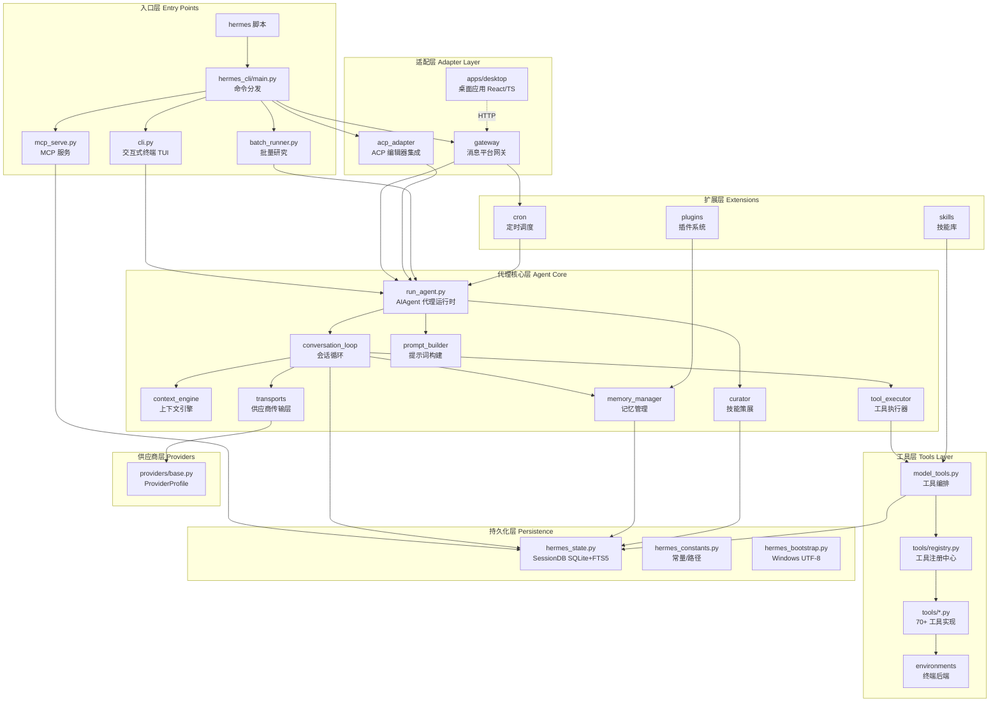
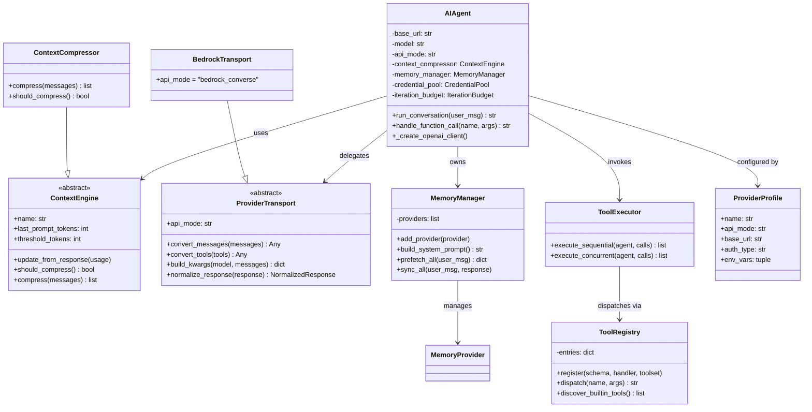
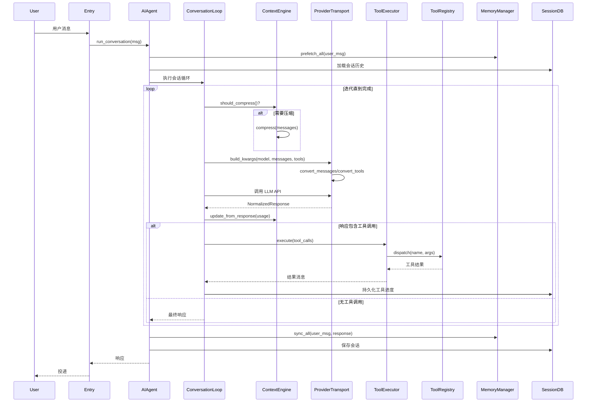
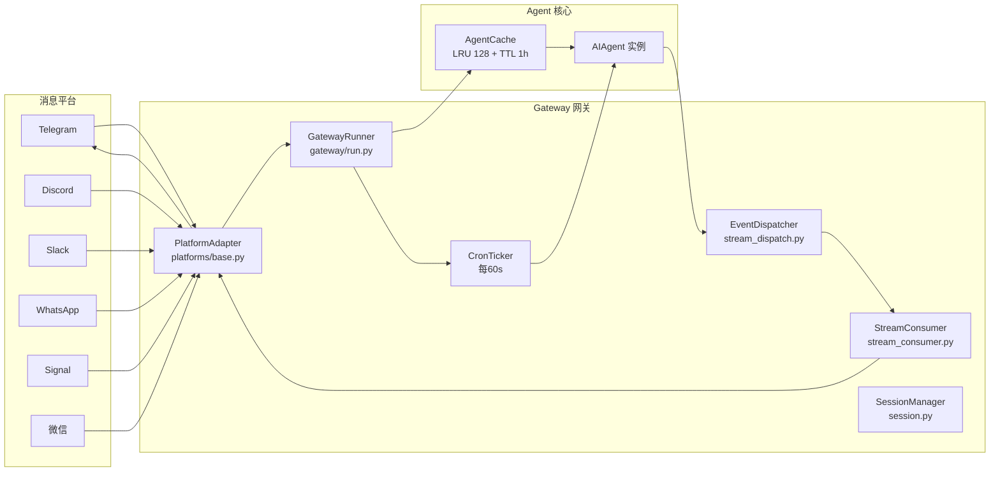
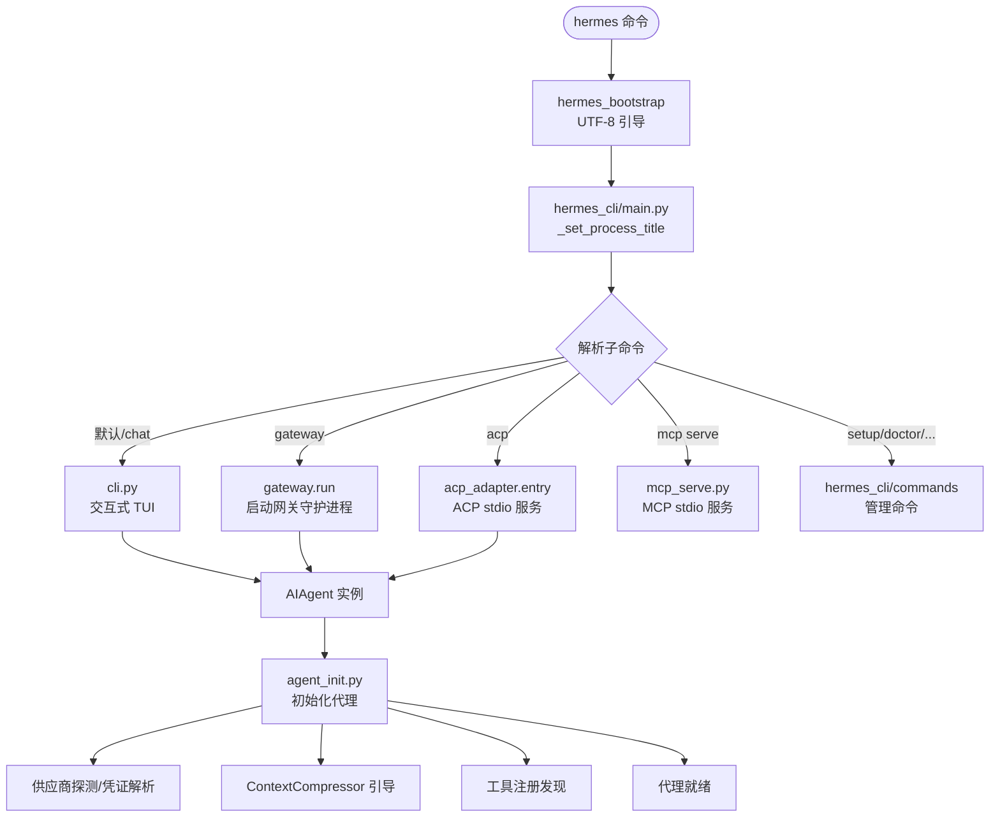

# Hermes Agent 组件级架构分析

## 一、项目定位

Hermes Agent 是 Nous Research 开发的**自改进 AI 代理**。核心特性：内置学习循环（从经验创建技能）、多平台消息网关（Telegram/Discord/Slack 等）、多模型供应商支持、定时任务、子代理委派、6 种终端后端（本地/Docker/SSH/Modal/Daytona/Singularity）。

---

## 二、分层架构总览图

---

## 三、组件说明（功能 + 代码路径）

### 1. 入口与引导层

| 组件 | 功能 | 代码路径 |
|------|------|----------|
| **hermes_bootstrap** | Windows UTF-8 引导，所有入口最先导入，修复 cp1252 编码问题；POSIX 空操作 | `hermes_bootstrap.py` |
| **CLI 终端界面** | 基于 prompt_toolkit 的交互式 TUI/CLI，多行编辑、斜杠命令、流式输出 | `cli.py` |
| **CLI 命令分发** | 主入口，分发 chat/gateway/setup/model/tools/cron/doctor 等子命令 | `hermes_cli/main.py` |
| **批量运行器** | 并行批量处理数据集，生成训练轨迹，支持断点续跑 | `batch_runner.py` |
| **MCP 服务** | 将会话暴露为 MCP 工具，供 Claude Code/Cursor 等调用 | `mcp_serve.py` |

### 2. 代理核心层 (`agent/`)

| 组件 | 功能 | 代码路径 |
|------|------|----------|
| **AIAgent 代理运行时** | 核心代理类（60+ 参数），管理会话流、工具调用、响应处理 | `run_agent.py` |
| **代理初始化** | AIAgent.__init__ 的实现，属性初始化、供应商探测、凭证解析、上下文引擎引导 | `agent/agent_init.py` |
| **会话循环** | 核心 run_conversation 循环：模型调用→工具分发→重试→降级→压缩→后置钩子 | `agent/conversation_loop.py` |
| **上下文引擎** | 可插拔上下文管理抽象基类，决定何时压缩、如何压缩 | `agent/context_engine.py` |
| **上下文压缩器** | 默认上下文压缩实现（摘要式） | `agent/context_compressor.py` |
| **工具执行器** | 顺序/并发工具调用分发 | `agent/tool_executor.py` |
| **记忆管理器** | 编排记忆供应商，系统提示注入、轮前预取、轮后同步 | `agent/memory_manager.py` |
| **技能策展器** | 后台技能维护，自动归档/合并/补丁 agent 创建的技能 | `agent/curator.py` |
| **供应商传输层** | 抽象基类，负责消息/工具格式转换、响应归一化 | `agent/transports/base.py` |
| **Bedrock/Codex 传输** | AWS Bedrock Converse、Codex 专用传输实现 | `agent/transports/bedrock.py`, `agent/transports/codex.py` |
| **提示词构建** | 系统提示词组装 | `agent/prompt_builder.py`, `agent/system_prompt.py` |
| **工具护栏** | 工具调用安全决策 | `agent/tool_guardrails.py` |
| **错误分类/重试** | API 错误分类、自适应限流退避 | `agent/error_classifier.py`, `agent/retry_utils.py` |
| **凭证池** | 多凭证轮换管理 | `agent/credential_pool.py` |
| **LSP 集成** | 语言服务器协议，代码编辑诊断 | `agent/lsp/` |
| **宠物/伴侣** | 桌面宠物渲染与状态 | `agent/pet/` |

### 3. 工具层 (`tools/`)

| 组件 | 功能 | 代码路径 |
|------|------|----------|
| **工具注册中心** | 中心化注册表，各工具自注册 schema/handler | `tools/registry.py` |
| **工具编排** | 注册表之上的薄编排层，供 run_agent/cli 调用 | `model_tools.py` |
| **终端后端** | 6 种执行环境：local/docker/ssh/modal/daytona/singularity | `tools/environments/` |
| **文件工具** | 文件读写/编辑/搜索 | `tools/file_tools.py` |
| **终端工具** | Shell 命令执行 | `tools/terminal_tool.py` |
| **浏览器工具** | 网页浏览 | `tools/browser_tool.py` |
| **代码执行** | Python 沙箱执行 | `tools/code_execution_tool.py` |
| **委派工具** | 生成隔离子代理并行工作 | `tools/delegate_tool.py` |
| **MCP 工具** | 接入外部 MCP 服务器 | `tools/mcp_tool.py` |
| **技能工具** | 技能管理 | `tools/skills_tool.py` |
| **计算机使用** | CUA 屏幕操作 | `tools/computer_use/` |

### 4. 网关层 (`gateway/`)

| 组件 | 功能 | 代码路径 |
|------|------|----------|
| **网关运行器** | 启动/管理所有平台适配器，代理缓存（LRU+TTL） | `gateway/run.py` |
| **平台适配器基类** | 抽象适配器接口 | `gateway/platforms/base.py` |
| **Signal/微信适配器** | 平台特定实现 | `gateway/platforms/signal.py`, `gateway/platforms/weixin.py` |
| **流事件分发** | 类型化流事件路由到投递 sink | `gateway/stream_dispatch.py` |
| **流消费者** | 助手文本流消费 | `gateway/stream_consumer.py` |
| **会话管理** | 网关会话上下文 | `gateway/session.py`, `gateway/session_context.py` |
| **斜杠命令** | 平台内斜杠命令 | `gateway/slash_commands.py` |
| **缩容到零** | 空闲时缩容（serverless） | `gateway/scale_to_zero.py` |

### 5. ACP 适配层 (`acp_adapter/`)

| 组件 | 功能 | 代码路径 |
|------|------|----------|
| **ACP 入口** | CLI 入口，加载环境、配置日志 | `acp_adapter/entry.py` |
| **ACP 服务器** | 通过 Agent Client Protocol 暴露代理 | `acp_adapter/server.py` |
| **ACP 会话** | ACP 会话管理 | `acp_adapter/session.py` |

### 6. CLI 命令层 (`hermes_cli/`)

| 组件 | 功能 | 代码路径 |
|------|------|----------|
| **配置管理** | config.yaml 读写 | `hermes_cli/config.py` |
| **供应商管理** | 模型供应商配置 | `hermes_cli/providers.py` |
| **模型管理** | 模型切换 | `hermes_cli/models.py` |
| **MCP 配置** | MCP 服务器配置 | `hermes_cli/mcp_config.py` |
| **看板** | Kanban 任务板 | `hermes_cli/kanban.py` |

### 7. 持久化与基础设施

| 组件 | 功能 | 代码路径 |
|------|------|----------|
| **SessionDB** | SQLite 状态存储，FTS5 全文搜索，会话元数据/消息历史 | `hermes_state.py` |
| **常量** | HERMES_HOME 路径等 | `hermes_constants.py` |
| **定时调度** | tick 式 cron 调度，网关每 60s 调用 | `cron/scheduler.py` |
| **插件系统** | 记忆/Spotify/网页搜索插件 | `plugins/` |

---

## 四、核心代理类 UML 类图

---

## 五、会话循环时序图（核心调用流）

---

## 六、网关多平台架构图

---

## 七、启动流程与入口选择图

---

## 八、关键调用关系总结

| 调用方 | 被调方 | 关系说明 |
|--------|--------|----------|
| 入口层 (CLI/Gateway/ACP/Batch) | `run_agent.AIAgent` | 所有入口共享同一个代理运行时 |
| `AIAgent` | `conversation_loop` | 代理将核心循环委托给 loop 模块 |
| `conversation_loop` | `ProviderTransport` | 循环通过传输层调用 LLM API |
| `conversation_loop` | `tool_executor` | 循环将工具调用委托给执行器 |
| `tool_executor` | `model_tools` → `registry` | 执行器通过注册中心分发工具 |
| `AIAgent` | `ContextEngine` | 代理持有上下文引擎管理 token |
| `AIAgent` | `MemoryManager` | 代理持有记忆管理器，轮前预取/轮后同步 |
| `AIAgent` | `curator` | 空闲时触发后台技能策展 |
| `GatewayRunner` | `AIAgent` (缓存) | 网关按会话缓存代理实例（LRU+TTL） |
| `GatewayRunner` | `cron.scheduler` | 网关每 60s 触发 cron tick |
| `cron.scheduler` | `AIAgent` | 定时任务创建临时代理执行 |
| `acp_adapter.server` | `AIAgent` | ACP 将编辑器请求转为代理调用 |
| `plugins` | `MemoryManager` | 插件注册为记忆供应商 |
| 所有组件 | `hermes_state.SessionDB` | 统一 SQLite 持久化层 |
| 所有入口 | `hermes_bootstrap` | 启动时首先导入，修复编码 |

---

## 九、架构特点总结

1. **单一代理运行时，多入口共享**：`AIAgent` 是核心，CLI/Gateway/ACP/Batch/Cron 五个入口全部复用，避免逻辑重复。

2. **传输层与供应商配置分离**：`ProviderTransport`（格式转换）与 `ProviderProfile`（声明式供应商描述）解耦，新增供应商只需写 Profile。

3. **自注册工具系统**：`tools/registry.py` 通过 AST 扫描自动发现工具模块，`model_tools.py` 仅作薄编排层。

4. **可插拔上下文引擎**：`ContextEngine` 抽象基类允许第三方替换压缩策略（如 LCM）。

5. **网关适配器模式**：`BasePlatformAdapter` 统一所有平台，通过 `EventDispatcher` 将类型化事件路由到各平台渲染。

6. **关注点分离的提取式重构**：`run_agent.py` 的巨型方法被提取到 `agent/` 子模块（`conversation_loop`、`tool_executor`、`agent_init`），主类仅作转发器。
