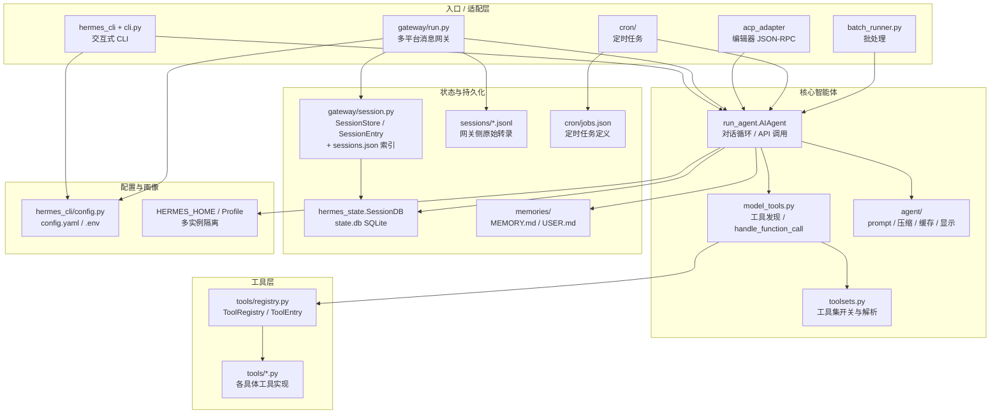
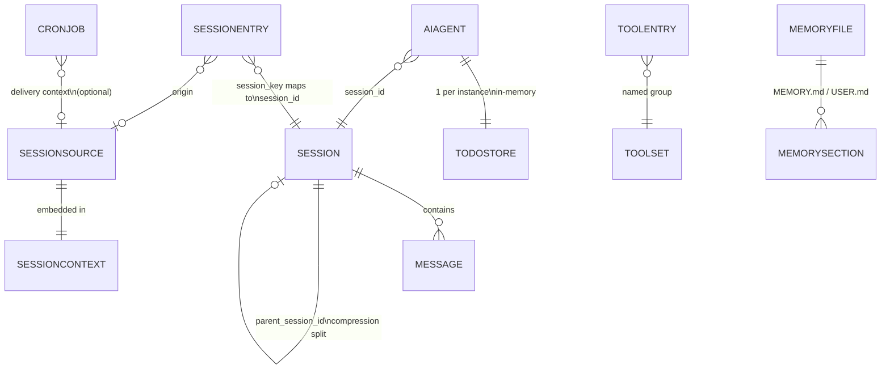

# Hermes Agent — 组件技术架构分析

本文档基于仓库代码与文档梳理 **Hermes Agent** 的组件划分、技术架构与实体模型。

---

## 1. 整体组件技术架构（分层）

项目是一个 **以 `AIAgent` 为核心的同步工具调用型 LLM 应用**，外围通过 **CLI、Gateway（多即时通讯平台）、ACP（编辑器）、Cron、批处理** 等入口驱动同一套 **模型 + 工具编排** 能力。

---

## 2. 主要组件与职责

| 组件 | 位置（典型） | 职责 |
|------|----------------|------|
| **AIAgent** | `run_agent.py` | 对话主循环：组装消息、调用 Chat Completions、处理 tool_calls、与 SessionDB/内存/Todo 等协作；支持回调、压缩、路由、checkpoint 等。 |
| **model_tools** | `model_tools.py` | 从 `ToolRegistry` 拉取 schema、按 toolset 过滤、`handle_function_call` 统一分发；同步/异步工具桥接（事件循环隔离）。 |
| **ToolRegistry / 工具实现** | `tools/registry.py`、`tools/*.py` | 工具自注册（schema、handler、可用性检查）；具体能力：文件、终端、浏览器、MCP、delegate 等。 |
| **toolsets** | `toolsets.py` | 定义核心/扩展工具集名称及解析，与 CLI/Gateway 的启用列表对齐。 |
| **agent/** | `agent/prompt_builder.py` 等 | 系统提示拼装、上下文压缩、Prompt 缓存、辅助模型、展示/Spinner、技能注入辅助等。 |
| **HermesCLI** | `cli.py`、`hermes_cli/` | 交互式终端：`/command`、皮肤、配置、模型切换、工具与技能子命令。 |
| **Gateway** | `gateway/run.py`、`gateway/session.py`、`gateway/platforms/*` | 异步多平台机器人：收消息、解析 slash、构造 `SessionSource`/`SessionContext`、调 `AIAgent`、回写频道；会话重置策略、PII 策略等。 |
| **SessionDB** | `hermes_state.py` | 全局 SQLite：`sessions` + `messages` + FTS5；CLI/Gateway/ACP 共用，支持会话检索与计费类字段。 |
| **SessionStore（网关）** | `gateway/session.py` | 按 **session_key**（平台+聊天+用户等）维护 **SessionEntry**，映射到 **session_id**，并配合 `sessions.json` 与 SQLite。 |
| **ACP SessionManager** | `acp_adapter/session.py` | 编辑器侧会话 ↔ `AIAgent`，与会话 DB 打通以便重启后恢复与搜索。 |
| **Cron** | `cron/jobs.py`、`cron/scheduler.py` | `jobs.json` 存任务定义，输出到 `cron/output/`；到点触发代理逻辑。 |
| **batch_runner** | `batch_runner.py` | 并行/批量跑任务（与主会话库分离存储策略，见文档）。 |
| **plugins/** | `plugins/memory/*` 等 | 可选记忆后端（如 Honcho、全息存储等），与内置文件记忆并行或扩展。 |
| **environments/** | `environments/` | RL/训练环境与工具调用解析器（与主产品路径可交叉引用）。 |

---

## 3. 主要实体模型

### 3.1 持久化与领域实体

| 实体 | 含义 | 典型存储 |
|------|------|----------|
| **Session（会话）** | 一次可追溯的对话实例：来源平台、用户、模型、标题、token/费用汇总、**parent_session_id**（压缩拆分 lineage）等。 | `state.db` → `sessions` |
| **Message（消息）** | 单条 role/content、可选 tool_calls/tool 结果、reasoning 等。 | `state.db` → `messages`；**FTS** 在 `messages_fts` |
| **SessionEntry** | 网关索引：**session_key → session_id**，含更新时间、来源 `SessionSource`、token 累计、自动重置标记等。 | `~/.hermes/sessions/sessions.json` + 与 DB 协同 |
| **SessionSource** | 消息来自哪里：平台、`chat_id`、群/频道/线程、`user_id` 等。 | 内存 + 序列化进 SessionEntry |
| **SessionContext** | 给系统提示用的「当前环境」：`SessionSource` + 已连接平台 + home_channels。 | 运行时构造，可序列化 |
| **Tool / ToolEntry** | 工具名、所属 toolset、JSON schema、handler、环境依赖。 | 进程内 `ToolRegistry` |
| **Cron Job** | 定时表达式、技能列表、投递目标等。 | `cron/jobs.json` |
| **Memory 条目** | 结构化/非结构化长期记忆（文件型）。 | `memories/MEMORY.md`、`USER.md`（按 profile 在 `HERMES_HOME` 下） |
| **Todo** | 会话内任务列表（规划用）。 | `TodoStore`：**每 Agent 实例内存**，见 `run_agent` 与 `todo_tool` |
| **API Response 状态**（若启用网关 HTTP API） | Responses API 的 previous_response_id 链。 | `response_store.db`（`gateway/platforms/api_server.py`） |
| **Trajectory** | 训练/分析用轨迹（与主 SessionDB 策略分离）。 | 独立机制（见 `agent/trajectory.py` 与文档） |

### 3.2 插件扩展实体（示例）

- **Holographic MemoryStore**：`memory_store.db` 中的 **facts** 等（实体解析、信任分等）——见 `plugins/memory/holographic/store.py`。
- **Honcho**：外部「用户建模」会话，与现有 SQLite **并行**，不替代 `SessionDB` 主模型。

---

## 4. 实体关系（概念 ER）

### 关系说明

1. **Session 1:N Message**；**Session 自关联** 表示上下文压缩产生的新会话链接到父会话。
2. **Gateway**：业务键 **SessionKey** 对应 **SessionEntry**，其中持有 **session_id**，与 **SessionDB** 里同 id 的 **Session** 对齐。
3. **SessionSource** 描述「谁在哪个房间说话」，**SessionContext** 再叠加多平台连接信息，供提示词与路由使用。
4. **工具**侧是 **Toolset 1:N ToolEntry**，运行期由 **ToolRegistry** 管理，不进入 `state.db`。
5. **Cron** 任务可关联向某 **SessionSource** 投递结果（概念上依赖网关路由）。
6. **Todo** 绑定 **AIAgent 实例**，不默认落库；**文件记忆**与 **Session** 弱耦合（同 profile 目录下长期存在）。

---

## 5. 小结

- **架构中心**是 **`AIAgent` + `model_tools` + `ToolRegistry`**；**所有产品形态**（CLI / Gateway / ACP / Cron / 批跑）都围绕这条链路展开。
- **跨会话的「真源」实体**主要是 **`Session` / `Message`（SQLite）** 与网关侧的 **`SessionEntry` + session_key**；**长期用户知识**落在 **memories 文件** 与可选 **插件 DB**；**会话内规划**用内存 **Todo**。
