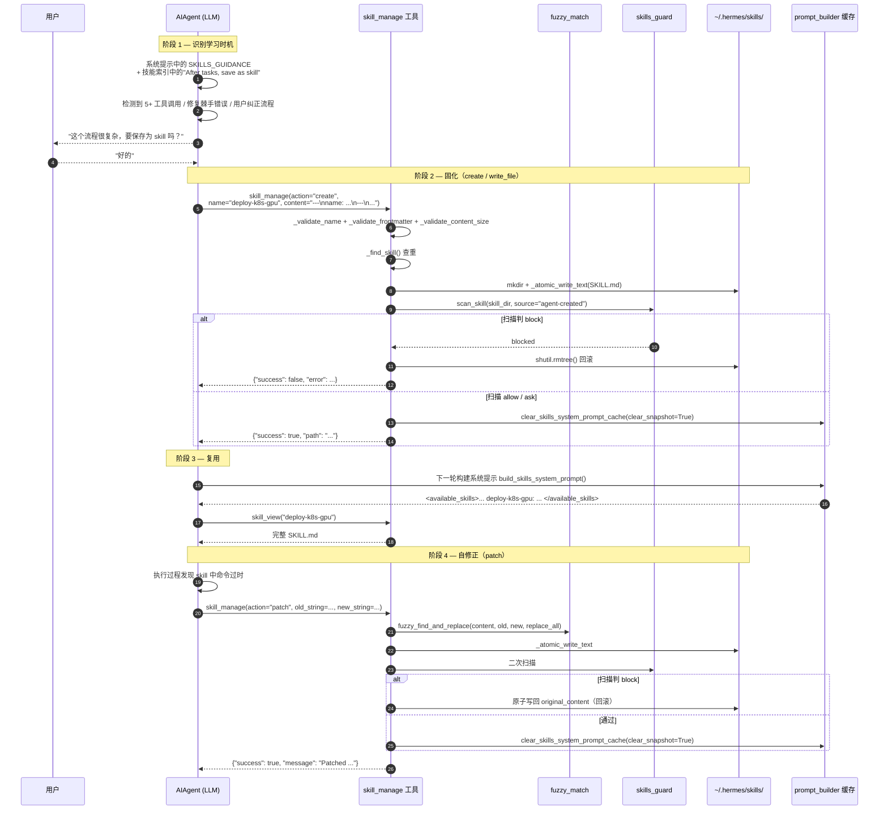
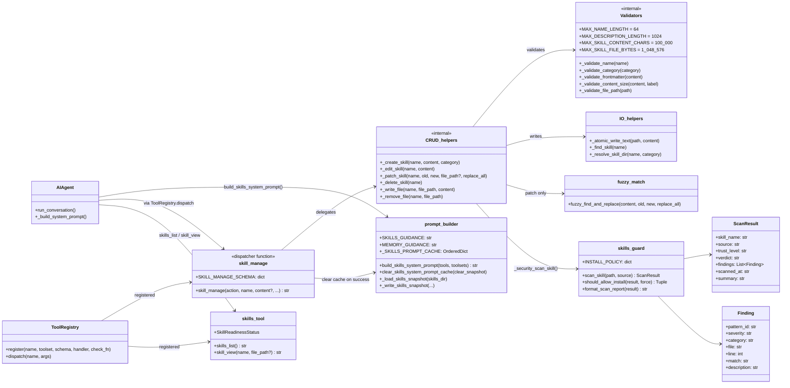

# Hermes Agent — Skill 自进化机制实现走读

> 本文档基于源码（`tools/skill_manager_tool.py`、`tools/skills_guard.py`、`tools/skills_tool.py`、`agent/prompt_builder.py`）逐行核实，是对同目录下 [`skill-self-evolution.md`](./skill-self-evolution.md) 的补充。重点在于**实现流程、类图与可直接对应到源码行号的代码片段**。

---

## 目录

1. [核心理念](#1-核心理念)
2. [总体流程图（时序图）](#2-总体流程图时序图)
3. [自进化生命周期（状态视图）](#3-自进化生命周期状态视图)
4. [类图 / 组件关系](#4-类图--组件关系)
5. [关键代码片段](#5-关键代码片段)
6. [Memory 与 Skill 的分工](#6-memory-与-skill-的分工)
7. [触发条件清单](#7-触发条件清单)
8. [总结](#8-总结)

---

## 1. 核心理念

Hermes **没有专门叫"自进化"的子系统**。它的 Skill 自进化本质是 **"提示工程 + 简洁文件工具 + 安全扫描"** 三件套构成的正反馈环路：

| 环节 | 实现方式 |
|---|---|
| ① 何时学 | 系统提示中明确告诉 LLM「复杂任务后请保存为 skill」 |
| ② 如何写 | LLM 通过 `skill_manage` 工具对 `~/.hermes/skills/` 进行 CRUD |
| ③ 立刻生效 | 写入后清理 `_SKILLS_PROMPT_CACHE`，下次 turn 系统提示就出现新 skill |
| ④ 如何改 | 系统提示同样指导「使用旧 skill 发现遗漏就立即 patch」 |
| ⑤ 安全门 | `skills_guard.scan_skill` 走 `agent-created` 信任策略，违规自动回滚 |

构成 **经验 → 固化 → 复用 → 修正** 的闭环。

---

## 2. 总体流程图（时序图）



> **关键点**：所有写入都是 **"先原子写 → 后扫描 → 失败回滚"**，绝不留半成品文件。

---

## 3. 自进化生命周期（状态视图）

```
┌───────────────────────────────────────────────────────────────────┐
│                       Skill 自进化生命周期                         │
│                                                                   │
│  ┌──────────┐    ┌──────────┐    ┌──────────┐    ┌──────────┐    │
│  │ 1. 发现  │───▶│ 2. 固化  │───▶│ 3. 复用  │───▶│ 4. 修正  │    │
│  │ 复杂任务 │    │ create + │    │ 系统提示 │    │ patch 命 │    │
│  │ 后识别可 │    │ 安全扫描 │    │ 出现新   │    │ 令 / 修步 │    │
│  │ 复用流程 │    │ 写 SKILL │    │ skill 并 │    │ 骤 / 补陷 │    │
│  │          │    │   .md    │    │ skill_   │    │ 阱        │    │
│  │          │    │          │    │ view 加载│    │           │    │
│  └──────────┘    └──────────┘    └──────────┘    └────┬─────┘    │
│       ▲                                                │          │
│       └────────────────── 持续循环 ────────────────────┘          │
└───────────────────────────────────────────────────────────────────┘
```

---

## 4. 类图 / 组件关系



---

## 5. 关键代码片段

### 5.1 驱动自进化的系统提示词

[`agent/prompt_builder.py:153-180`](../agent/prompt_builder.py)

```python
# agent/prompt_builder.py
MEMORY_GUIDANCE = (
    "... If you've discovered a new way to do something, solved a problem "
    "that could be necessary later, save it as a skill with the skill tool."
)

SKILLS_GUIDANCE = (
    "After completing a complex task (5+ tool calls), fixing a tricky error, "
    "or discovering a non-trivial workflow, save the approach as a "
    "skill with skill_manage so you can reuse it next time.\n"
    "When using a skill and finding it outdated, incomplete, or wrong, "
    "patch it immediately with skill_manage(action='patch') — don't wait to be asked. "
    "Skills that aren't maintained become liabilities."
)
```

技能索引头部也会再嵌一段指令 ([`build_skills_system_prompt`](../agent/prompt_builder.py))：

```python
result = (
    "## Skills (mandatory)\n"
    "Before replying, scan the skills below. If one clearly matches your task, "
    "load it with skill_view(name) and follow its instructions. "
    "If a skill has issues, fix it with skill_manage(action='patch').\n"
    "After difficult/iterative tasks, offer to save as a skill. "
    "If a skill you loaded was missing steps, had wrong commands, or needed "
    "pitfalls you discovered, update it before finishing.\n"
    "\n"
    "<available_skills>\n"
    + "\n".join(index_lines) + "\n"
    "</available_skills>\n"
    "\n"
    "If none match, proceed normally without loading a skill."
)
```

`SKILL_MANAGE_SCHEMA.description` 同样把"何时 create / 何时 patch"编码进 schema 给模型读 ([`tools/skill_manager_tool.py:657-677`](../tools/skill_manager_tool.py))：

```python
SKILL_MANAGE_SCHEMA = {
    "name": "skill_manage",
    "description": (
        "Manage skills (create, update, delete). Skills are your procedural "
        "memory — reusable approaches for recurring task types. ...\n\n"
        "Create when: complex task succeeded (5+ calls), errors overcome, "
        "user-corrected approach worked, non-trivial workflow discovered, "
        "or user asks you to remember a procedure.\n"
        "Update when: instructions stale/wrong, OS-specific failures, "
        "missing steps or pitfalls found during use. "
        "If you used a skill and hit issues not covered by it, patch it immediately.\n\n"
        "After difficult/iterative tasks, offer to save as a skill. "
        "Skip for simple one-offs. Confirm with user before creating/deleting."
    ),
    ...
}
```

---

### 5.2 `skill_manage` 调度入口

[`tools/skill_manager_tool.py:591-650`](../tools/skill_manager_tool.py)

```python
def skill_manage(action, name, content=None, category=None,
                 file_path=None, file_content=None,
                 old_string=None, new_string=None, replace_all=False) -> str:
    if action == "create":
        result = _create_skill(name, content, category)
    elif action == "edit":
        result = _edit_skill(name, content)
    elif action == "patch":
        result = _patch_skill(name, old_string, new_string, file_path, replace_all)
    elif action == "delete":
        result = _delete_skill(name)
    elif action == "write_file":
        result = _write_file(name, file_path, file_content)
    elif action == "remove_file":
        result = _remove_file(name, file_path)
    else:
        result = {"success": False, "error": f"Unknown action '{action}'..."}

    # 关键：任何一次成功的变更都立刻清缓存
    if result.get("success"):
        try:
            from agent.prompt_builder import clear_skills_system_prompt_cache
            clear_skills_system_prompt_cache(clear_snapshot=True)
        except Exception:
            pass

    return json.dumps(result, ensure_ascii=False)
```

---

### 5.3 创建 skill（含回滚保护）

[`tools/skill_manager_tool.py:294-349`](../tools/skill_manager_tool.py)

```python
def _create_skill(name, content, category=None) -> Dict[str, Any]:
    # 1. 多层校验
    err = _validate_name(name)            or \
          _validate_category(category)    or \
          _validate_frontmatter(content)  or \
          _validate_content_size(content)
    if err: return {"success": False, "error": err}

    # 2. 跨目录查重（防止 bundled / hub / 用户技能同名）
    if _find_skill(name):
        return {"success": False, "error": f"A skill named '{name}' already exists ..."}

    # 3. 原子写入 SKILL.md
    skill_dir = _resolve_skill_dir(name, category)
    skill_dir.mkdir(parents=True, exist_ok=True)
    skill_md = skill_dir / "SKILL.md"
    _atomic_write_text(skill_md, content)

    # 4. 安全扫描 — block 则整目录删除回滚
    scan_error = _security_scan_skill(skill_dir)
    if scan_error:
        shutil.rmtree(skill_dir, ignore_errors=True)
        return {"success": False, "error": scan_error}

    return {"success": True, "message": f"Skill '{name}' created.",
            "path": str(skill_dir.relative_to(SKILLS_DIR)),
            "skill_md": str(skill_md),
            "hint": "To add reference files... use skill_manage(action='write_file', ...)"}
```

---

### 5.4 Patch 自修正（模糊匹配 + 回滚）

[`tools/skill_manager_tool.py:386-470`](../tools/skill_manager_tool.py)

```python
def _patch_skill(name, old_string, new_string, file_path=None, replace_all=False):
    existing = _find_skill(name)
    if not existing:
        return {"success": False, "error": f"Skill '{name}' not found."}

    skill_dir = existing["path"]
    target = skill_dir / (file_path or "SKILL.md")
    if not target.exists():
        return {"success": False, "error": f"File not found: ..."}

    content = target.read_text(encoding="utf-8")

    # 复用 file_tools 的 fuzzy 引擎，容忍空白/缩进/转义差异
    from tools.fuzzy_match import fuzzy_find_and_replace
    new_content, match_count, match_error = fuzzy_find_and_replace(
        content, old_string, new_string, replace_all
    )
    if match_error:
        return {"success": False, "error": match_error,
                "file_preview": content[:500] + ("..." if len(content) > 500 else "")}

    # 改 SKILL.md 还需再次校验 frontmatter 结构未被破坏
    if not file_path:
        err = _validate_frontmatter(new_content)
        if err:
            return {"success": False,
                    "error": f"Patch would break SKILL.md structure: {err}"}

    original_content = content                # 备份
    _atomic_write_text(target, new_content)
    scan_error = _security_scan_skill(skill_dir)
    if scan_error:
        _atomic_write_text(target, original_content)  # 回滚
        return {"success": False, "error": scan_error}

    return {"success": True,
            "message": f"Patched {file_path or 'SKILL.md'} in skill '{name}' "
                       f"({match_count} replacement{'s' if match_count > 1 else ''})."}
```

---

### 5.5 安全守卫：对 agent-created 的特殊策略

[`tools/skills_guard.py:44-51`](../tools/skills_guard.py)

```python
INSTALL_POLICY = {
    #                  safe      caution    dangerous
    "builtin":       ("allow",  "allow",   "allow"),
    "trusted":       ("allow",  "allow",   "block"),
    "community":     ("allow",  "block",   "block"),
    "agent-created": ("allow",  "allow",   "ask"),   # ← Agent 自创技能策略
}
```

`agent-created` 在 `safe` / `caution` 自动放行，`dangerous` 走 `ask`（不会阻塞模型，但会写 warning 日志，便于后续审计）。

[`tools/skill_manager_tool.py:60-79`](../tools/skill_manager_tool.py)

```python
def _security_scan_skill(skill_dir: Path) -> Optional[str]:
    if not _GUARD_AVAILABLE: return None
    try:
        result = scan_skill(skill_dir, source="agent-created")
        allowed, reason = should_allow_install(result)
        if allowed is False:
            return f"Security scan blocked this skill ({reason}):\n{format_scan_report(result)}"
        if allowed is None:    # "ask" — 仅记日志，放行
            logger.warning("Agent-created skill has security findings: %s", reason)
    except Exception as e:
        logger.warning("Security scan failed for %s: %s", skill_dir, e, exc_info=True)
    return None
```

---

### 5.6 缓存失效：让新 skill 下一回合立刻可见

[`agent/prompt_builder.py:383-403`](../agent/prompt_builder.py)

```python
_SKILLS_PROMPT_CACHE_MAX = 8
_SKILLS_PROMPT_CACHE: OrderedDict[tuple, str] = OrderedDict()
_SKILLS_PROMPT_CACHE_LOCK = threading.Lock()

def clear_skills_system_prompt_cache(*, clear_snapshot: bool = False) -> None:
    with _SKILLS_PROMPT_CACHE_LOCK:
        _SKILLS_PROMPT_CACHE.clear()
    if clear_snapshot:
        try:
            _skills_prompt_snapshot_path().unlink(missing_ok=True)
        except OSError as e:
            logger.debug("Could not remove skills prompt snapshot: %s", e)
```

`build_skills_system_prompt()` 是 **两层缓存** 的：进程内 `OrderedDict` LRU + 磁盘 `~/.hermes/.skills_prompt_snapshot.json`（通过 mtime/size manifest 验证）。`skill_manage` 成功后用 `clear_snapshot=True` 双层清空，下一轮系统提示重新扫盘并出现新条目。

---

### 5.7 渐进式披露：索引 vs 全文

| 工具 | 作用 | 注入位置 |
|---|---|---|
| `build_skills_system_prompt()` | 仅写入 **name + description** 的索引 | 系统提示 |
| `skills_list` (`tools/skills_tool.py`) | 列出所有 skill 的 metadata | 模型可主动调用 |
| `skill_view(name)` | 加载完整 SKILL.md | 按需展开 |
| `skill_view(name, file_path)` | 加载 references/templates 中的链接文件 | 二级展开 |

这样 Agent 看到的"目录"是常驻、便宜的；只有真正要用时才把完整步骤拉进上下文 — 这是 Anthropic 倡导的 "Progressive Disclosure"。

---

### 5.8 网关侧的"过期前抢救"

在网关多平台场景下，会话被 idle/daily 策略重置前，`gateway/run.py` 中的 `_flush_memories_for_session` 会启动一个一次性 Agent，提示其"复盘对话并保存值得的记忆 / 技能"，让自进化在长跑场景下也有强制性的"固化时刻"。

---

## 6. Memory 与 Skill 的分工

`memory_tool` 与 `skill_manage` 表面相似，但在系统提示与 schema 描述中被明确划分：

| 维度 | Memory (`MEMORY.md` / `USER.md`) | Skill (`SKILL.md`) |
|---|---|---|
| 知识类型 | **声明式** "what is" — 用户偏好、环境事实 | **程序式** "how to" — 具体步骤、命令、验证 |
| 颗粒度 | 宽泛、跨领域 | 窄而可执行 |
| 注入方式 | 冻结进系统提示 | 索引在系统提示，正文按需 `skill_view` |
| 写入工具 | `memory(action="add")` | `skill_manage(action="create")` |
| 修改工具 | `memory(action="replace/remove")` | `skill_manage(action="patch/edit")` |
| 生效时机 | 下次会话 | `clear_skills_system_prompt_cache` 立即生效 |

由此让 LLM 在面对"环境约定" vs "操作步骤"时有清晰的归口。

---

## 7. 触发条件清单

**触发 `create`（来自 schema description 与 SKILLS_GUIDANCE）**
- 复杂任务完成（≥5 次工具调用）
- 克服了棘手错误
- 用户纠正后的方法生效
- 发现了非平凡工作流
- 用户明确要求"记住这套流程"

**触发 `patch`（来自 SKILLS_GUIDANCE 与索引头部指令）**
- 使用 skill 时命令执行失败
- 发现遗漏的步骤或陷阱
- OS-specific 差异
- 指令明确要求："don't wait to be asked"

---

## 8. 总结

Hermes 的 Skill 自进化能用极少代码实现，核心在于三点：

1. **行为指令写在系统提示与工具 schema 里**：让 LLM 自己充当"经验固化"决策者，而不是用额外的 ML 系统训练
2. **写入工具极简但安全**：6 个 action（create / edit / patch / delete / write_file / remove_file）+ 强校验 + 安全扫描 + 原子写 + 失败回滚
3. **缓存即时失效**：`clear_skills_system_prompt_cache(clear_snapshot=True)` 让"刚写完的 skill 下一轮就出现在索引里"，闭环立刻打通

整套机制只用到 **3 个工具（`skills_list`、`skill_view`、`skill_manage`）+ 1 个安全模块（`skills_guard`）+ 1 段提示词（`SKILLS_GUIDANCE`）**，就实现了完整的"学习 → 记忆 → 复用 → 修正"循环。

> 想看更长版本的设计沉思，请阅读同目录的 [`skill-self-evolution.md`](./skill-self-evolution.md)，它额外讨论了为什么不用 RAG、不用 fine-tuning，而选择 "prompt + 文件 + 扫描" 这条路线。

---

> **生成日期**：2026-06-06  
> **生成方式**：基于源码逐行核实
