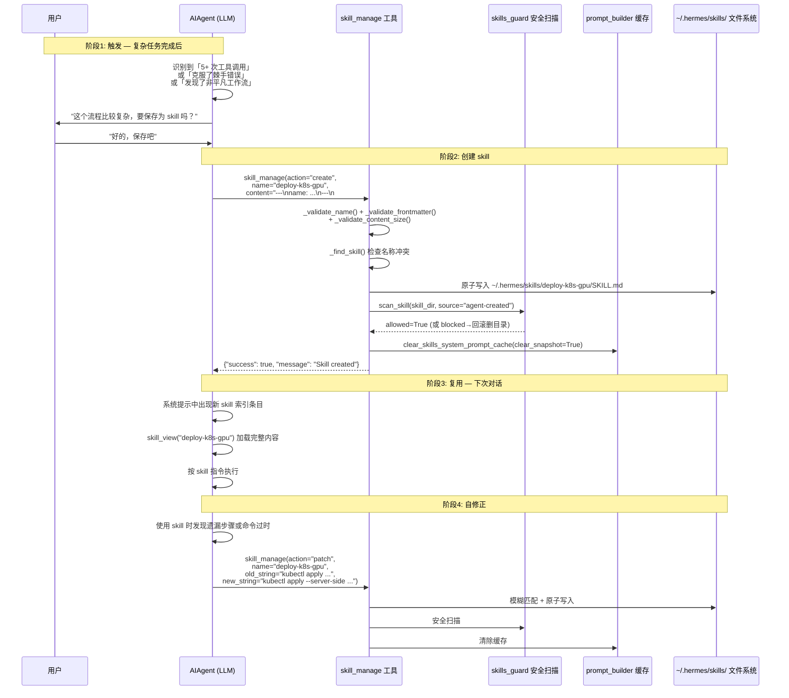

# Hermes Agent — Skill 自进化机制分析

## 0. 核心结论

Hermes Agent 没有名为"自进化"的独立子系统。其 **skill 自进化本质上是一种"指令驱动的程序性记忆捕获"**：

1. Agent 在系统提示中被明确指导"完成复杂任务后主动提议保存为 skill"
2. Agent 通过 `skill_manage` 工具创建/修改 skill 文件
3. 新 skill 立即生效（下次对话会出现在系统提示的技能索引中）
4. Agent 在使用已有 skill 时发现问题，被指导"立即 patch 修正，不要等人要求"

这构成了一个 **经验→固化→复用→修正** 的正反馈环路。

---

## 1. 自进化的核心流程



---

## 2. 涉及的关键文件与类

### 2.1 文件总览

| 文件 | 职责 | 在自进化中的角色 |
|------|------|------------------|
| `tools/skill_manager_tool.py` | skill 的 CRUD 操作 | **核心执行者** — 创建/编辑/补丁/删除 skill |
| `tools/skills_tool.py` | skill 的只读查询 | 列表/查看 — Agent 在创建前先了解现有格式 |
| `tools/skills_guard.py` | 安全扫描 | 对 agent-created skill 做静态分析 |
| `agent/prompt_builder.py` | 系统提示组装 | 注入"应该创建 skill"的指导语 + 技能索引 |
| `agent/skill_commands.py` | /skill-name 斜杠命令 | 将 skill 内容注入为用户消息 |
| `agent/skill_utils.py` | 公共工具函数 | 路径发现、frontmatter 解析、平台过滤 |
| `tools/skills_sync.py` | 内置 skill 同步 | 首次安装时拷贝种子 skill |
| `tools/skills_hub.py` | Hub 安装 | 从社区仓库安装第三方 skill |
| `hermes_cli/skills_config.py` | 启用/禁用配置 | `hermes skills` 命令管理 |
| `gateway/run.py` | 网关会话管理 | 会话过期前 flush memories/skills |
| `tools/memory_tool.py` | 文件记忆 | 引导"程序性知识应保存为 skill 而非 memory" |
| `toolsets.py` | 工具集定义 | `skills` 工具集含 `skills_list`、`skill_view`、`skill_manage` |

### 2.2 关键类与数据结构

```
tools/skills_guard.py
├── Finding          — 单条扫描发现（pattern_id, severity, category, file, line, match）
├── ScanResult       — 完整扫描结果（skill_name, source, trust_level, verdict, findings）
└── INSTALL_POLICY   — 信任级别×严重度 → allow/block/ask 矩阵

tools/skills_tool.py
├── SkillReadinessStatus  — 枚举：AVAILABLE / SETUP_NEEDED / UNSUPPORTED
└── _find_all_skills()    — rglob("SKILL.md") 全局发现

tools/skill_manager_tool.py
├── _create_skill()    — 新建 skill 目录 + SKILL.md
├── _edit_skill()      — 全文覆盖
├── _patch_skill()     — fuzzy find-and-replace
├── _delete_skill()    — 删除目录
├── _write_file()      — 写附属文件 (references/templates/scripts/assets)
├── _remove_file()     — 删附属文件
└── skill_manage()     — 对外入口，按 action 分发

agent/prompt_builder.py
├── build_skills_system_prompt()           — 构建 <available_skills> 索引
├── clear_skills_system_prompt_cache()     — 新 skill 创建后刷新缓存
├── MEMORY_GUIDANCE                        — "保存为 skill" 指导语
└── SKILL_EVOLUTION_GUIDANCE               — "主动 patch 过时 skill" 指导语

agent/skill_commands.py
├── scan_skill_commands()         — 扫描已安装 skill 生成 /slug 映射
└── build_skill_invocation_message()  — 将 skill 内容包装为用户消息注入
```

---

## 3. 驱动自进化的关键代码

### 3.1 系统提示中的进化指导（prompt_builder.py）

这是驱动 Agent "主动创建和修正 skill" 的核心机制 — **不是代码逻辑，而是提示工程**：

```python
# agent/prompt_builder.py

MEMORY_GUIDANCE = (
    "... If you've discovered a new way to do something, solved a problem "
    "that could be necessary later, save it as a skill with the skill tool."
)

SKILL_EVOLUTION_GUIDANCE = (
    "After completing a complex task (5+ tool calls), fixing a tricky error, "
    "or discovering a non-trivial workflow, save the approach as a "
    "skill with skill_manage so you can reuse it next time.\n"
    "When using a skill and finding it outdated, incomplete, or wrong, "
    "patch it immediately with skill_manage(action='patch') — don't wait to be asked. "
    "Skills that aren't maintained become liabilities."
)
```

技能索引中也有进化指令：

```python
# build_skills_system_prompt() 的返回文本中
"Before replying, scan the skills below. If one clearly matches your task, "
"load it with skill_view(name) and follow its instructions. "
"If a skill has issues, fix it with skill_manage(action='patch').\n"
"After difficult/iterative tasks, offer to save as a skill. "
"If a skill you loaded was missing steps, had wrong commands, or needed "
"pitfalls you discovered, update it before finishing.\n"
```

### 3.2 skill_manage 工具的 Schema 描述

Schema description 同样编码了进化策略，直接教模型何时创建/更新：

```python
# tools/skill_manager_tool.py — SKILL_MANAGE_SCHEMA

"description": (
    "...Create when: complex task succeeded (5+ calls), errors overcome, "
    "user-corrected approach worked, non-trivial workflow discovered, "
    "or user asks you to remember a procedure.\n"
    "Update when: instructions stale/wrong, OS-specific failures, "
    "missing steps or pitfalls found during use. "
    "If you used a skill and hit issues not covered by it, patch it immediately.\n\n"
    "After difficult/iterative tasks, offer to save as a skill. "
    "Skip for simple one-offs. Confirm with user before creating/deleting."
)
```

### 3.3 创建 skill 的核心实现

```python
# tools/skill_manager_tool.py

def _create_skill(name: str, content: str, category: str = None) -> Dict[str, Any]:
    # 1. 校验名称、分类、frontmatter、内容大小
    err = _validate_name(name)
    err = _validate_frontmatter(content)      # 要求 name + description
    err = _validate_content_size(content)      # 上限 100K 字符

    # 2. 检查名称冲突（跨所有 skill 目录）
    existing = _find_skill(name)
    if existing: return error

    # 3. 创建目录 + 原子写入 SKILL.md
    skill_dir = SKILLS_DIR / (category / name if category else name)
    skill_dir.mkdir(parents=True, exist_ok=True)
    _atomic_write_text(skill_dir / "SKILL.md", content)

    # 4. 安全扫描（失败则删除整目录回滚）
    scan_error = _security_scan_skill(skill_dir)
    if scan_error:
        shutil.rmtree(skill_dir, ignore_errors=True)
        return error

    # 5. 刷新技能缓存（下次对话系统提示会包含新 skill）
    clear_skills_system_prompt_cache(clear_snapshot=True)

    return {"success": True, "message": f"Skill '{name}' created."}
```

### 3.4 Patch 自修正（fuzzy 匹配）

```python
# tools/skill_manager_tool.py

def _patch_skill(name, old_string, new_string, file_path=None, replace_all=False):
    # 使用与 file_tools 相同的模糊匹配引擎
    from tools.fuzzy_match import fuzzy_find_and_replace
    new_content, match_count, match_error = fuzzy_find_and_replace(
        content, old_string, new_string, replace_all
    )

    # 改 SKILL.md 后重新校验 frontmatter 结构
    if not file_path:
        err = _validate_frontmatter(new_content)

    # 原子写入 + 安全扫描 + 回滚保护
    _atomic_write_text(target, new_content)
    scan_error = _security_scan_skill(skill_dir)
    if scan_error:
        _atomic_write_text(target, original_content)  # 回滚
```

### 3.5 安全守卫（agent-created 信任策略）

```python
# tools/skills_guard.py

INSTALL_POLICY = {
    #              safe      caution    dangerous
    "builtin":    ("allow",  "allow",   "allow"),
    "trusted":    ("allow",  "allow",   "block"),
    "community":  ("allow",  "block",   "block"),
    "agent-created": ("allow", "allow", "ask"),    # ← Agent 自创 skill 的策略
}
```

Agent 创建的 skill 在 `safe` 和 `caution` 级别自动放行，`dangerous` 级别走 `ask`（记日志但不阻断）。

### 3.6 会话过期时的 skill 保存

```python
# gateway/run.py

def _flush_memories_for_session(self, old_session_id):
    """Prompt the agent to save memories/skills before context is lost."""
    # 创建一个短跑 Agent，带上对话历史，
    # 系统提示指导其保存重要记忆和技能
    flush_agent = AIAgent(...)
    flush_agent.run_conversation(
        user_message="Review the conversation and save any important "
                     "memories or skills before this session is cleared.",
        conversation_history=history,
    )
```

---

## 4. Skill 文件格式与目录结构

### 4.1 SKILL.md 格式

```yaml
---
name: deploy-k8s-gpu          # 必填，≤64 字符
description: Deploy GPU...     # 必填，≤1024 字符
version: 1.0.0                 # 可选
platforms: [linux]             # 可选，限定 OS
metadata:
  hermes:
    tags: [devops, kubernetes]
    related_skills: [docker-build]
required_environment_variables:
  - name: KUBECONFIG
    prompt: "Path to kubeconfig"
    help: "https://..."
---

# Deploy GPU Workloads to Kubernetes

## When to use
- User asks to deploy to K8s with GPU
- Container image needs GPU scheduling

## Steps
1. Verify cluster access...
2. Create namespace...

## Pitfalls
- Node selector must match GPU node labels
```

### 4.2 目录结构

```
~/.hermes/skills/
├── deploy-k8s-gpu/
│   ├── SKILL.md               # 主文件（必须）
│   ├── references/             # 参考文档
│   │   └── gpu-scheduling.md
│   ├── templates/              # 模板文件
│   │   └── deployment.yaml
│   ├── scripts/                # 可执行脚本
│   │   └── validate.sh
│   └── assets/                 # 附属资源
├── devops/                     # 分类目录（可选层级）
│   └── ci-pipeline/
│       └── SKILL.md
└── .bundled_manifest           # 内置 skill 同步清单
```

---

## 5. 技能索引在系统提示中的呈现

```python
# agent/prompt_builder.py — build_skills_system_prompt()

# 三层缓存策略：
# 1. 内存 LRU（_SKILLS_PROMPT_CACHE）
# 2. 磁盘快照（.skills_prompt_snapshot.json）
# 3. 全量扫描 rglob("SKILL.md")
```

生成的系统提示片段示例：

```
<available_skills>
- deploy-k8s-gpu: Deploy GPU workloads to Kubernetes with proper scheduling
- ci-pipeline: Set up CI/CD pipeline with GitHub Actions
- axolotl: Fine-tune LLMs using Axolotl framework
</available_skills>
```

---

## 6. 自进化的完整生命周期

```
┌─────────────────────────────────────────────────────────────────┐
│                      Skill 自进化生命周期                        │
│                                                                 │
│  ┌──────────┐    ┌──────────┐    ┌──────────┐    ┌──────────┐  │
│  │ 1. 发现  │───>│ 2. 固化  │───>│ 3. 复用  │───>│ 4. 修正  │  │
│  │          │    │          │    │          │    │          │  │
│  │ Agent 在 │    │ Agent 调 │    │ 新对话中 │    │ Agent 发 │  │
│  │ 复杂任务 │    │ skill_   │    │ 系统提示 │    │ 现 skill │  │
│  │ 后识别出 │    │ manage() │    │ 展示该   │    │ 内容有误 │  │
│  │ 可复用的 │    │ create   │    │ skill，  │    │ 或过时， │  │
│  │ 程序性   │    │ 写入     │    │ Agent    │    │ 立即用   │  │
│  │ 知识     │    │ SKILL.md │    │ 按指令   │    │ patch    │  │
│  │          │    │          │    │ 执行     │    │ 修正     │  │
│  └──────────┘    └──────────┘    └──────────┘    └────┬─────┘  │
│       ↑                                               │        │
│       └───────────────────────────────────────────────┘        │
│                      持续进化循环                               │
└─────────────────────────────────────────────────────────────────┘
```

**触发时机：**
- 复杂任务完成（5+ 次工具调用）
- 克服了棘手错误
- 用户纠正后的方法生效
- 发现了非平凡工作流
- 用户明确要求记住某个流程

**修正时机：**
- 使用 skill 时命令执行失败
- 发现遗漏的步骤或陷阱
- OS 特定的差异
- 被指导"不要等人要求，立即 patch"

---

## 7. memory 与 skill 的分工

```python
# tools/memory_tool.py — schema description 中明确界定：

# memory (MEMORY.md / USER.md):
#   - 声明式知识：环境事实、项目约定、用户偏好
#   - 宽泛、跨领域
#   - 冻结快照注入系统提示

# skill (SKILL.md):
#   - 程序性知识：具体步骤、命令、验证方法
#   - 窄且可执行
#   - 按需加载（渐进式披露）
```

Agent 被指导：当发现的知识是"如何做某件事"（程序性的），应保存为 skill 而非 memory。

---

## 8. 与 memory 系统的协同

| 维度 | Memory | Skill |
|------|--------|-------|
| 存储 | `memories/MEMORY.md`, `USER.md` | `skills/<name>/SKILL.md` |
| 注入方式 | 会话开始时冻结进系统提示 | 索引在系统提示，全文按需 `skill_view` 加载 |
| 写入工具 | `memory(action="add")` | `skill_manage(action="create")` |
| 修改工具 | `memory(action="replace/remove")` | `skill_manage(action="patch/edit")` |
| 缓存刷新 | 下次会话生效 | `clear_skills_system_prompt_cache()` 立即生效 |
| 知识类型 | 声明式（what is） | 程序式（how to） |

---

## 9. 总结

Hermes Agent 的 skill 自进化机制的精妙之处在于：**它不是一个复杂的 ML 系统，而是通过精心设计的提示工程 + 简洁的文件工具 + 安全扫描，让 LLM 自身充当"经验固化"和"持续改进"的执行者。**

核心组件只有 3 个工具（`skills_list`、`skill_view`、`skill_manage`），加上系统提示中的行为指导和一个安全守卫，就实现了一个完整的"学习→记忆→复用→修正"循环。
