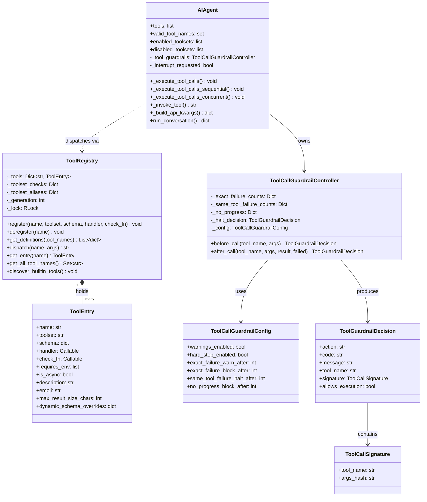
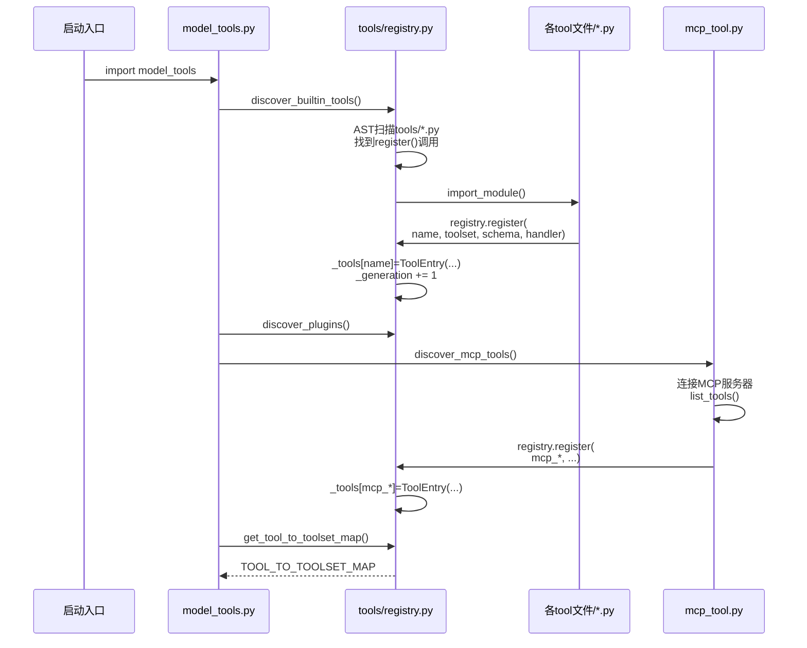
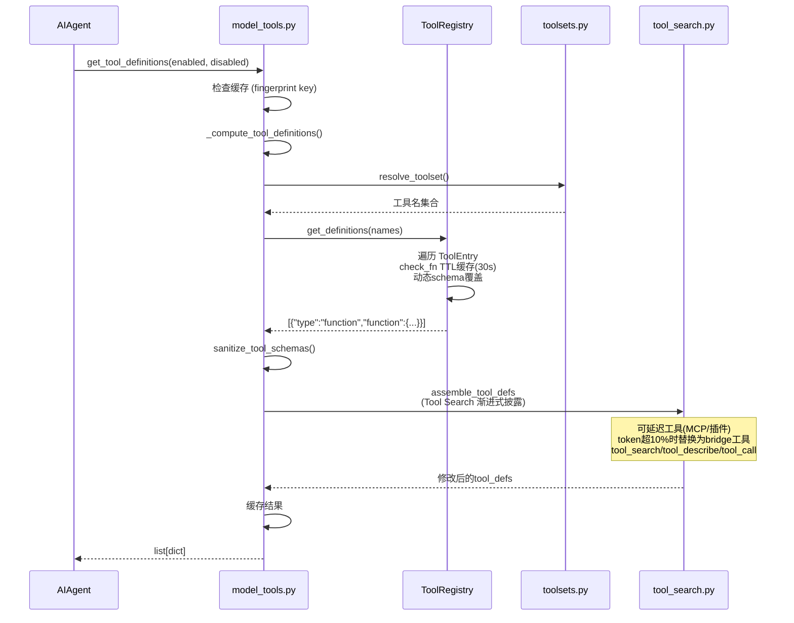
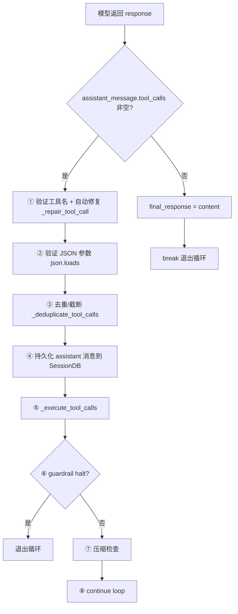
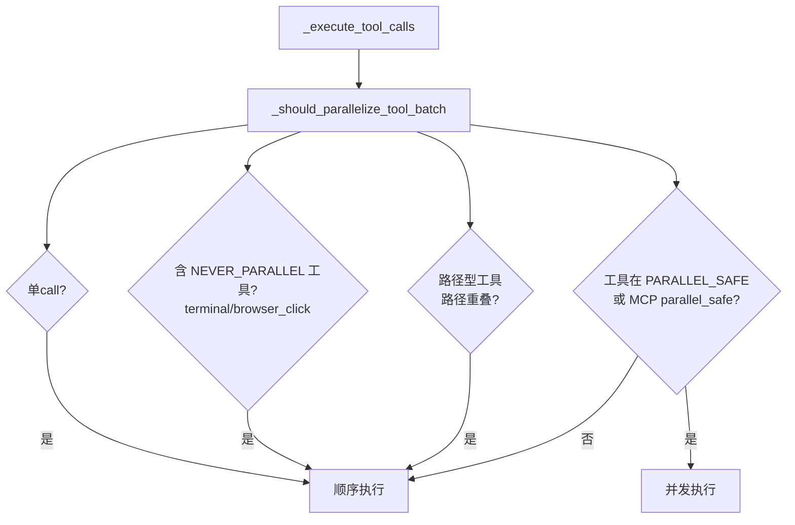
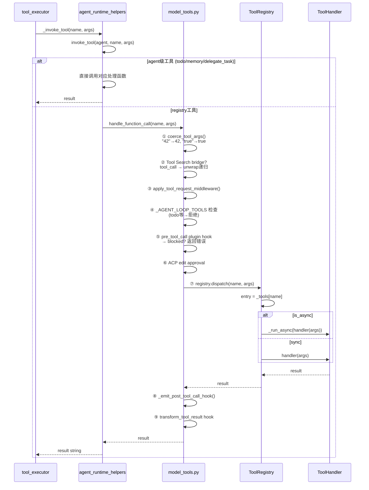
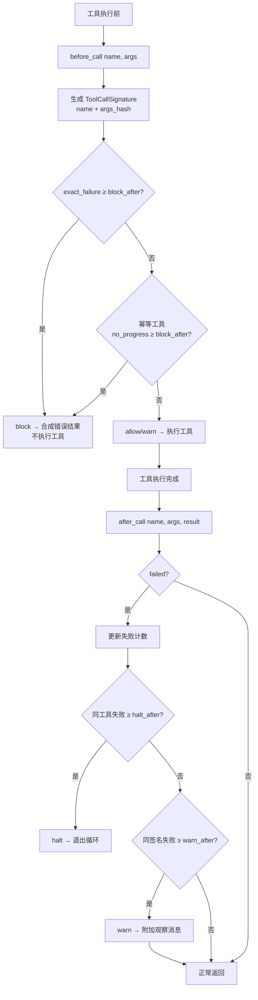
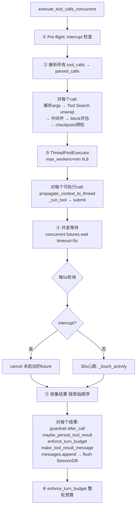
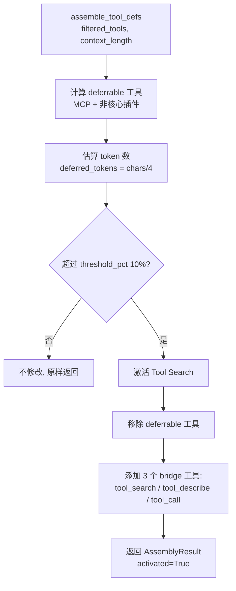

# HermesAgent 工具调用实现分析

## 一、整体架构概览

HermesAgent 的工具系统采用 **自注册式注册表 + 薄编排层** 架构。每个工具文件在导入时通过 `registry.register()` 自注册 schema/handler，`model_tools.py` 作为编排层提供公共 API，`agent/tool_executor.py` 负责实际调度执行。

### 涉及的核心文件

| 层次 | 文件 | 职责 |
|------|------|------|
| 入口层 | `cli.py` | CLI 脚本入口，创建 AIAgent 并调用 `run_conversation` |
| Agent 主类 | `run_agent.py` | `AIAgent` 类，持有工具列表和所有状态 |
| 初始化层 | `agent/agent_init.py` | `init_agent()` 加载工具定义 |
| Schema 获取 | `model_tools.py` | 薄编排层，`get_tool_definitions` / `handle_function_call` |
| 注册表层 | `tools/registry.py` | `ToolRegistry` 单例 + `ToolEntry` 元数据 |
| 会话循环 | `agent/conversation_loop.py` | `run_conversation()` 主循环 |
| API 构建 | `agent/chat_completion_helpers.py` | `build_api_kwargs()` 构建 API 请求 |
| 工具执行 | `agent/tool_executor.py` | 顺序/并发执行实现 |
| 并行决策 | `agent/tool_dispatch_helpers.py` | `_should_parallelize_tool_batch()` |
| 工具转发 | `agent/agent_runtime_helpers.py` | `invoke_tool()` 区分 agent 级/registry 工具 |
| 守卫层 | `agent/tool_guardrails.py` | `ToolCallGuardrailController` 双阶段守护 |
| 工具定义 | `tools/file_tools.py` 等 | 各工具文件自注册 |

---

## 二、工具管理类图



---

## 三、完整调用链路序列图（从 cli.py 启动到工具执行）

```mermaid
sequenceDiagram
    actor User as 用户
    participant CLI as cli.py
    participant Agent as AIAgent<br/>(run_agent.py)
    participant Init as agent_init.py
    participant MT as model_tools.py
    participant Reg as ToolRegistry<br/>(registry.py)
    participant Loop as conversation_loop.py
    participant API as OpenAI API
    participant TE as tool_executor.py
    participant Helpers as agent_runtime_helpers.py

    User->>CLI: 启动 python cli.py
    CLI->>Agent: AIAgent(base_url, model, toolsets...)
    Agent->>Init: init_agent(self, ...)
    Init->>MT: get_tool_definitions(enabled, disabled)
    MT->>MT: discover_builtin_tools() (AST扫描)
    Note over MT,Reg: 模块导入时已触发<br/>registry.register()
    MT->>Reg: get_definitions(tool_names)
    Reg->>Reg: 遍历 ToolEntry<br/>check_fn TTL缓存(30s)
    Reg-->>MT: [{"type":"function","function":{...}}]
    MT->>MT: Tool Search assemble<br/>(渐进式披露)
    MT-->>Init: schema列表
    Init->>Agent: agent.tools = schemas<br/>agent.valid_tool_names = set

    User->>CLI: 输入消息
    CLI->>Agent: run_conversation(user_message, history)
    Agent->>Loop: run_conversation(self, ...)

    loop WHILE api_call_count < max_iterations
        Loop->>Loop: build_api_kwargs(api_messages)<br/>tools=agent.tools
        Loop->>API: run_llm_execution_middleware(<br/>api_kwargs, _perform_api_call)
        API-->>Loop: response (含 tool_calls?)

        alt tool_calls 非空
            Loop->>Loop: ① 验证工具名 (_repair_tool_call)<br/>② 验证 JSON 参数<br/>③ 去重/截断<br/>④ 持久化 assistant 消息
            Loop->>Agent: _execute_tool_calls(<br/>assistant_message, messages)
            Agent->>TE: _should_parallelize?<br/>sequential / concurrent

            alt 顺序路径
                TE->>TE: for tc in tool_calls:
                TE->>TE: 中断检查 → Tool Search unwrap<br/>→ 请求中间件 → Plugin hook<br/>→ Guardrail before_call<br/>→ Checkpoint 预检
                TE->>Helpers: _invoke_tool(name, args)
                alt agent级工具 (todo/memory/delegate)
                    Helpers->>Helpers: 直接调用对应处理函数
                else registry工具
                    Helpers->>MT: handle_function_call(name, args)
                    MT->>MT: coerce_tool_args()<br/>ACP审批检查<br/>run_tool_execution_middleware()
                    MT->>Reg: dispatch(name, args)
                    Reg->>Reg: entry.handler(args)
                    Reg-->>MT: result
                    MT->>MT: _emit_post_tool_call_hook()<br/>transform_tool_result hook
                    MT-->>Helpers: result
                end
                Helpers-->>TE: result string
                TE->>TE: maybe_persist_tool_result()<br/>enforce_turn_budget()<br/>Guardrail after_call()<br/>make_tool_result_message()<br/>messages.append → flush SessionDB
            else 并行路径
                TE->>TE: ThreadPoolExecutor(max_workers=min(N,8))<br/>propagate_context_to_thread(_run_tool)
                TE->>TE: concurrent.futures.wait(5s轮询)<br/>interrupt? → cancel
                TE->>TE: 收集结果(按原序)<br/>guardrail after_call → 持久化<br/>→ messages.append → flush
            end

            TE-->>Agent: 完成
            Agent-->>Loop: 继续
        else 无 tool_calls
            Loop->>Loop: final_response = content<br/>break
        end
    end

    Loop-->>Agent: result dict
    Agent-->>CLI: result
    CLI-->>User: 输出响应
```

---

## 四、场景 1：工具注册（启动期）



### 对应代码

注册表核心 — `tools/registry.py`：

`ToolEntry` 是每个工具的元数据容器：

```python
class ToolEntry:
    __slots__ = ("name", "toolset", "schema", "handler", "check_fn",
                 "requires_env", "is_async", "description", "emoji",
                 "max_result_size_chars", "dynamic_schema_overrides")
```

`ToolRegistry.register()` 负责注册：

```python
def register(self, name, toolset, schema, handler, check_fn=None, ...):
    with self._lock:
        existing = self._tools.get(name)
        if existing and existing.toolset != toolset:
            # 防止意外覆盖：MCP-MCP允许，插件需 override=True
            ...
        self._tools[name] = ToolEntry(name=name, toolset=toolset, ...)
        self._generation += 1
```

自注册示例 — `tools/file_tools.py`：

```python
registry.register(name="read_file", toolset="file", schema=READ_FILE_SCHEMA,
                  handler=_handle_read_file, check_fn=_check_file_reqs,
                  emoji="📖", max_result_size_chars=100_000)
registry.register(name="write_file", toolset="file", schema=WRITE_FILE_SCHEMA,
                  handler=_handle_write_file, ...)
```

发现机制 — `discover_builtin_tools()` 用 AST 扫描判断模块是否包含顶层 `registry.register()` 调用，避免无谓导入。

MCP 动态注册 — `tools/mcp_tool.py`：

```python
registry.register(
    name=tool_name_prefixed,       # 如 "mcp_filesystem_read_file"
    toolset=toolset_name,           # "mcp-<server>"
    schema=schema,
    handler=_make_tool_handler(name, mcp_tool.name, server.tool_timeout),
    check_fn=_make_check_fn(name),
    is_async=False,
)
```

---

## 五、场景 2：工具 Schema 获取（每轮 API 调用前）



### 对应代码

`get_tool_definitions()` 带多层缓存 — `model_tools.py`：

```python
def get_tool_definitions(enabled_toolsets=None, disabled_toolsets=None,
                         quiet_mode=False, skip_tool_search_assembly=False):
    # 缓存key = (enabled, disabled, registry._generation, config指纹, ...)
    cache_key = (frozenset(enabled_toolsets), ..., registry._generation, cfg_fp, ...)
    cached = _tool_defs_cache.get(cache_key)
    if cached is not None:
        return list(cached)
    result = _compute_tool_definitions(...)
    _tool_defs_cache[cache_key] = result
    return list(result)
```

Tool Search 渐进式披露 — `tools/tool_search.py`：当可延迟工具（MCP/插件）token 超过上下文窗口 10% 时，替换为三个 bridge 工具 `tool_search` / `tool_describe` / `tool_call`。

---

## 六、场景 3：工具调用执行（核心流程）

这是最关键的场景，覆盖从模型返回 tool_calls 到结果写回 messages 的完整生命周期。

### 6.1 会话循环中检测 tool_calls



### 对应代码

会话循环入口 — `agent/conversation_loop.py`：

```python
# 检测 tool_calls
if assistant_message.tool_calls:
    # ① 验证工具名 + 自动修复
    for tc in assistant_message.tool_calls:
        if tc.function.name not in agent.valid_tool_names:
            repaired = agent._repair_tool_call(tc.function.name)
            if repaired:
                tc.function.name = repaired
    # ② 验证 JSON 参数
    for tc in assistant_message.tool_calls:
        args = tc.function.arguments
        ...
        json.loads(args)  # 解析失败则重试或注入错误
    # ③ 去重/截断
    assistant_message.tool_calls = agent._deduplicate_tool_calls(...)
    # ④ 持久化
    messages.append(assistant_msg)
    agent._flush_messages_to_session_db(messages, ...)
    # ⑤ 执行
    agent._execute_tool_calls(assistant_message, messages, effective_task_id, api_call_count)
```

### 6.2 并行/顺序决策



### 对应代码

并行/顺序决策 — `run_agent.py`：

```python
def _execute_tool_calls(self, assistant_message, messages, effective_task_id, ...):
    if not _should_parallelize_tool_batch(tool_calls):
        return self._execute_tool_calls_sequential(...)
    return self._execute_tool_calls_concurrent(...)
```

并行安全判断 — `agent/tool_dispatch_helpers.py`：只读工具可并行，路径型工具检查路径不重叠，交互式工具（terminal/browser_click 等）强制顺序。

```python
def _should_parallelize_tool_batch(tool_calls) -> bool:
    if len(tool_calls) <= 1:
        return False
    if any(name in _NEVER_PARALLEL_TOOLS for name in tool_names):
        return False  # terminal/browser_click 等强制顺序
    # 路径型工具检查路径不重叠
    if tool_name in _PATH_SCOPED_TOOLS:
        if any(_paths_overlap(scoped_path, existing) for existing in reserved_paths):
            return False
    if tool_name not in _PARALLEL_SAFE_TOOLS:
        if not _is_mcp_tool_parallel_safe(tool_name):
            return False
    return True
```

---

## 七、场景 4：工具分发（handle_function_call 内部）



### 对应代码

`handle_function_call()` — `model_tools.py`：

```python
def handle_function_call(function_name, function_args, task_id=None, ...):
    # ① 类型强制
    function_args = coerce_tool_args(function_name, function_args)

    # ② Tool Search bridge 分发
    if _ts_mod and _ts_mod.is_bridge_tool(function_name):
        if function_name == _ts_mod.TOOL_CALL_NAME:
            underlying_name, underlying_args, err = _ts_mod.resolve_underlying_call(...)
            return handle_function_call(underlying_name, underlying_args, ...)  # 递归

    # ③ 请求中间件
    if not skip_tool_request_middleware:
        function_args = apply_tool_request_middleware(...).payload

    # ④ Agent-loop 工具拦截
    if function_name in _AGENT_LOOP_TOOLS:
        return json.dumps({"error": f"{function_name} must be handled by the agent loop"})

    # ⑤ Plugin pre_tool_call hook
    if not skip_pre_tool_call_hook:
        block_message = get_pre_tool_call_block_message(...)
        if block_message: return json.dumps({"error": block_message})

    # ⑥ ACP 审批
    edit_block_message = maybe_require_edit_approval(function_name, function_args)

    # ⑦ 分发执行
    result = run_tool_execution_middleware(function_name, function_args,
        lambda next_args: registry.dispatch(function_name, next_args, ...), ...)

    # ⑧⑨ Post hooks
    _emit_post_tool_call_hook(...)
    return result
```

Registry 分发 — `tools/registry.py`：

```python
def dispatch(self, name, args, **kwargs):
    entry = self.get_entry(name)
    if not entry:
        return json.dumps({"error": f"Unknown tool: {name}"})
    if entry.is_async:
        return _run_async(entry.handler(args, **kwargs))
    return entry.handler(args, **kwargs)
```

`invoke_tool()` — `agent/agent_runtime_helpers.py`：

```python
def invoke_tool(agent, function_name, function_args, effective_task_id, ...):
    if function_name == "todo":
        def _execute(next_args): return _todo_tool(...)
    elif function_name == "memory":
        def _execute(next_args): return _memory_tool(...)
    elif function_name == "delegate_task":
        def _execute(next_args): return agent._dispatch_delegate_task(next_args)
    else:
        def _execute(next_args):
            return _ra().handle_function_call(function_name, next_args, ...)
    return run_tool_execution_middleware(function_name, function_args, _execute, ...)
```

---

## 八、场景 5：Guardrail 守卫流程



### 对应代码

`ToolCallGuardrailController` — `agent/tool_guardrails.py`：

```python
class ToolCallGuardrailController:
    def before_call(self, tool_name, args) -> ToolGuardrailDecision:
        signature = ToolCallSignature.from_call(tool_name, args)
        if not self.config.hard_stop_enabled:
            return ToolGuardrailDecision(tool_name=tool_name, signature=signature)
        # 完全相同调用失败次数 ≥ block_after → block
        exact_count = self._exact_failure_counts.get(signature, 0)
        if exact_count >= self.config.exact_failure_block_after:
            decision = ToolGuardrailDecision(action="block", ...)
            self._halt_decision = decision
            return decision
        # 幂等工具无进展 ≥ block_after → block
        if self._is_idempotent(tool_name):
            record = self._no_progress.get(signature)
            if record and record[1] >= self.config.no_progress_block_after:
                decision = ToolGuardrailDecision(action="block", ...)
                ...

    def after_call(self, tool_name, args, result, *, failed=None):
        if failed:
            # 更新失败计数
            exact_count += 1
            same_count += 1
            # 同工具失败 ≥ halt_after → halt
            if same_count >= self.config.same_tool_failure_halt_after:
                return ToolGuardrailDecision(action="halt", ...)
            # ≥ warn_after → warn
            if exact_count >= self.config.exact_failure_warn_after:
                return ToolGuardrailDecision(action="warn", ...)
```

在 `tool_executor.py` 中的调用点（concurrent 路径）：

```python
guardrail_decision = agent._tool_guardrails.before_call(function_name, function_args)
if not guardrail_decision.allows_execution:
    block_result = agent._guardrail_block_result(guardrail_decision)
    blocked_by_guardrail = True
```

---

## 九、场景 6：并发工具执行



### 对应代码

`execute_tool_calls_concurrent()` — `agent/tool_executor.py`。

线程上下文传播 — `tools/thread_context.py` `propagate_context_to_thread()` 确保 ContextVars（审批 session key 等）传递到工作线程。

---

## 十、场景 7：Tool Search 渐进式披露



模型调用 `tool_call` 时的 unwrap 流程见场景 4 中的 Tool Search bridge 分支 — bridge 对 hooks 透明，底层工具名被暴露给所有 guardrail/hook。

---

## 十一、关键设计要点总结

| 维度 | 实现方式 | 关键文件 |
|------|---------|---------|
| **注册机制** | 自注册式：工具文件模块级调用 `registry.register()` | `tools/registry.py` |
| **发现机制** | AST 扫描判断模块是否注册工具，避免无谓导入 | `tools/registry.py` `discover_builtin_tools()` |
| **Schema 缓存** | 多层缓存：fingerprint key + registry._generation + config mtime | `model_tools.py` `get_tool_definitions()` |
| **工具集过滤** | enabled/disabled toolsets + check_fn TTL(30s) | `model_tools.py` `_compute_tool_definitions()` |
| **并行调度** | ThreadPoolExecutor(max 8)，只读/路径不重叠可并行 | `agent/tool_executor.py` + `agent/tool_dispatch_helpers.py` |
| **Agent 级工具** | todo/memory/delegate_task 等需 agent 状态，不走 registry | `agent/agent_runtime_helpers.py` `invoke_tool()` |
| **守卫机制** | before_call/after_call 双阶段，warn 默认开，halt 需 opt-in | `agent/tool_guardrails.py` |
| **Hook 单次触发** | pre_tool_call 恰好一次，concurrent 路径提前检查后传 skip 标志 | `model_tools.py` `handle_function_call()` |
| **异步桥接** | 持久化事件循环 + 线程级 loop，避免 "Event loop is closed" | `model_tools.py` `_run_async()` |
| **结果预算** | 按上下文窗口缩放，单工具 + 整轮双重限制 | `tools/budget_config.py` + `tools/tool_result_storage.py` |
| **渐进式披露** | 大量 MCP/插件工具时替换为 3 个 bridge，节省 token | `tools/tool_search.py` |
| **中断处理** | `_interrupt_requested` 全局标志 + per-thread interrupt + future.cancel | `agent/tool_executor.py` |
| **增量持久化** | 每个工具结果后立即 flush SessionDB，防破坏性工具中途终止丢数据 | `agent/tool_executor.py` |

---

## 十二、完整调用链路总结

```
cli.py
  → AIAgent.__init__ → init_agent → get_tool_definitions → registry.get_definitions
    → agent.tools (schema列表)

用户输入 → run_conversation (循环)
  → build_api_kwargs(tools=agent.tools) → OpenAI API
  → response.tool_calls?
      → 验证工具名/JSON → _execute_tool_calls
          → _should_parallelize? → sequential/concurrent
              → 中断检查/中间件/plugin hook/guardrail before
              → _invoke_tool → invoke_tool
                  → agent级工具? 直接调用
                  → else: handle_function_call → registry.dispatch → handler
              → guardrail after → 持久化结果 → messages.append
      → continue loop
  → 无tool_calls → final_response → break
```

核心设计：
- **自注册式注册表**让工具解耦
- **编排层**（`model_tools.py`）统一分发入口
- **执行器**（`tool_executor.py`）负责顺序/并发调度
- **guardrail 控制器**双阶段守护防止循环
- **Agent 级工具**绕过 registry 直接访问 agent 状态

整个工具生命周期从注册 → Schema获取 → 模型调用 → 验证 → 预检（中间件/hook/guardrail/checkpoint）→ 执行 → 后处理（hook/结果存储/预算/guardrail）→ 持久化，每个环节都有对应的代码文件支撑。
